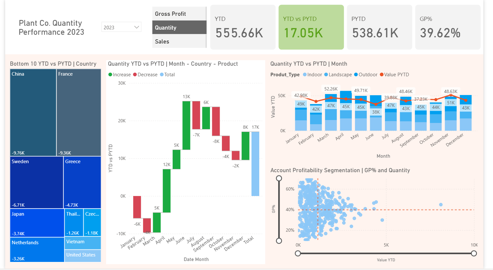

# 🌱 Plant Co. — Sales Performance Dashboard (Power BI)


> Quantity performance dashboard for Plant Co.—YTD vs PYTD comparison, multi-dimensional analysis by country, product, and time. Built with Power BI, DAX, and Power Query.

[Overview](#-overview) · [Dashboards](#-dashboards) · [Project Structure](#-project-structure) · [Getting Started](#-getting-started) · [Documentation](#-documentation)

---

## 📋 Overview

### 🎯 Problem Statement

> Plant Co. needs a single view of quantity performance across 2023–2024. Stakeholders want YTD vs prior-year comparison, breakdowns by country and product, without digging through spreadsheets.

### 💡 Solution

A **Power BI dashboard** that:

- Consolidates quantity metrics into one interactive interface
- Compares **year-to-date (YTD)** vs **prior year-to-date (PYTD)**
- Breaks down performance by country, month, and product type
- Uses **DAX** for YTD/PYTD, **Power Query** for transformation, and **star schema** modeling
- Enables dynamic filtering (year, quantity vs sales metric)

### ✨ Key Features

| Feature | Description |
|---------|-------------|
| 📊 **KPI cards** | Total quantity, YoY change, gross profit % |
| 📅 **YTD vs PYTD** | Year-to-date and prior-year comparison |
| 🌍 **Country breakdown** | Performance by market |
| 📦 **Product analysis** | Quantity and gross profit by product type |
| 📈 **Advanced charts** | Treemaps, waterfall, stacked bars, scatter |
| 🔧 **Dynamic filters** | Year selection; Quantity vs Sales toggle |

### 👥 Target Audience

- **Recruiters** — Power BI, DAX, Power Query, data modeling
- **Business analysts** — Sales and quantity performance
- **BI engineers** — ETL, star schema, comparative analytics

---

## 📊 Dashboards

### 🖼️ Dashboard Preview



### 📈 Key Visualizations

| Visual | Purpose |
|--------|---------|
| **KPI cards** | Total quantity, YoY change, gross profit % |
| **Treemap** | Performance by country or product |
| **Waterfall** | Contribution analysis; variance decomposition |
| **Stacked bar** | Quantity/sales by category or period |
| **Scatter** | Multi-dimensional correlation |
| **Filters** | Year, Quantity vs Sales metric toggle |

---

## 🛠️ Tech Stack

| Component | Technology |
|-----------|------------|
| **Visualization** | Microsoft Power BI Desktop |
| **ETL / Transform** | Power Query (M Language) |
| **Calculations** | DAX (YTD, PYTD, % calculations) |
| **Data modeling** | Star schema, relationships |
| **Data format** | CSV (accounts, products, sales) |

### 🔧 Tools & Techniques

- **Power Query** — Data cleaning, reshaping, preparation
- **DAX** — YTD, PYTD, percentage, custom measures
- **Data modeling** — Star schema; optimized model
- **Visuals** — Treemaps, waterfall, bar charts, scatter, KPI cards

---

## 📁 Project Structure

```
plant-sales-analytics-visualization-powerbi/
├── data/
│   └── raw/
│       ├── plant_accounts.csv
│       ├── plant_products.csv
│       └── plant_sales.csv
├── assets/
│   ├── powerbi/
│   │   └── plant_analytics_dashboard.pbix
│   └── image/
│       └── plant_analytics_dashboard.png
├── README.md
└── .gitignore
```

### 📂 Folder Descriptions

| Folder | Purpose |
|--------|---------|
| `data/raw/` | Source data (accounts, products, sales) |
| `assets/powerbi/` | Power BI report (.pbix) |
| `assets/image/` | Dashboard preview image |

---

## 🚀 Getting Started

### Prerequisites

- **Power BI Desktop** (free)
- Data files in `data/raw/`

### Quick Start

1. **Clone the repo**
   ```bash
   git clone https://github.com/Konstant-gk/plant-sales-analytics-visualization-powerbi.git
   cd plant-sales-analytics-visualization-powerbi
   ```

2. **Open the report**
   - Open `assets/powerbi/plant_analytics_dashboard.pbix` in Power BI Desktop
   - If prompted, point data sources to `data/raw/plant_accounts.csv`, `plant_products.csv`, `plant_sales.csv`

3. **Refresh data** (optional)
   - Home → Transform data, or refresh from report view

---

## 📈 Key Metrics

| Metric | Description |
|--------|-------------|
| **Quantity** | Units sold; YTD and PYTD |
| **Sales** | Revenue; YTD and PYTD |
| **Gross profit** | Profit margin % |
| **YoY change** | Year-over-year comparison |
| **Country** | Performance by market |
| **Product type** | Quantity/sales by category |
| **Time** | Day, week, month, quarter, year |

---

## 📚 Documentation

| Resource | Description |
|----------|-------------|
| [assets/image/](assets/image/) | Dashboard preview |
| [assets/powerbi/](assets/powerbi/) | Power BI report |

---

## ✅ What This Project Demonstrates

| Competency | How It's Shown |
|------------|----------------|
| **Power BI** | Reports, visuals, DAX, Power Query |
| **DAX** | YTD, PYTD, comparative analytics |
| **Data modeling** | Star schema, multi-table relationships |
| **ETL** | Power Query for cleaning and shaping |
| **Professional structure** | `data/`, `assets/` layout; clear README |
| **Portfolio readiness** | Scannable, recruiter-friendly docs |

---

## 🤝 Contributing

1. Fork the repository
2. Create a branch (`feat/`, `fix/`, `docs/`)
3. Open a Pull Request

---

## 📄 License

MIT — see [LICENSE](LICENSE) if present.

---

## 📬 Contact

- **Repository:** [Konstant-gk/plant-sales-analytics-visualization-powerbi](https://github.com/Konstant-gk/plant-sales-analytics-visualization-powerbi)
- **Issues:** [GitHub Issues](https://github.com/Konstant-gk/plant-sales-analytics-visualization-powerbi/issues)
